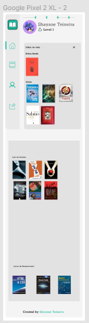
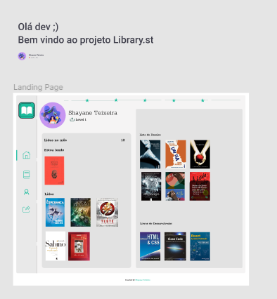

 

    

  <h3 align="center">Library.st</h3>

  

    Site para adicionar livros já lidos, o que estão sendo lidos, uma lista de desejo e a quantidade de lidos do mês
        
     
    <a href="https://github.com/ShaTeixeira/library.st">Desafio</a>
    ·
    <a href="https://www.linkedin.com/in/shayane-teixeira-4520b2196/">Contato</a>
  

## Índice

* [Devchallenge](#devchallenge) 
* [Desafio](#desafio)
* [Techs](#techs)
* [Como começar](#como-começar)
* [Dicas](#dicas)
  * [Cores](#cores)
  * [Modelo](#modelo)
  * [Imagens](#imagens)
  * [Tipo de fonte](#tipo-de-fonte)
* [Compartilhe](#compartilhe)

# Devchallenge
<a href="https://devchallenge.now.sh/"> DevChallenge</a> permite que você evolua suas skills como programador!

# Desafio
Seu desafio é criar uma página que possa ser adicionada livros novos para monitoramento. O modelo final está disponível na pasta "design"

  
# Techs: 
- [HTML]()
- [CSS]()

# Como começar:
1 - Use esse template ou clone esse repositório com o código inicial 
2 - Leia as instruções no readme.md 
3 - Comece a codar! Sinta-se livre para utilizar o fluxo de trabalho que ache mais confortável 
4 - Compartilhe seu resultado com a comunidade :) 

# Requisitos:
- Sua página deve se parecer o mais próximo possível ao modelo que está disponível na pasta "design" 
- Sua página deve ser responsiva

# Dicas
## Cores
|   |   |
|---|---|
| Verde  |  #1ABC9C  |  
|  Cinza |  #E2E2E2 |   
|  Cinza-Claro | #F5F4F4  |  
|Cinza-Navbar| #E9E9E9|
|Branco|#FFFFFF|

## Modelo:
O modelo está disponível na pasta `./design` 
Sefue link do [figma](https://www.figma.com/file/8TaOmrFaWWQeKWaKanTLZ9/Library.dev), para acessar você necessita clicar uma conta e `duplicar` o projeto.

## Imagens
As imagens utilizadas estão disponíveis na pasta `./assets` 
Para os ícones, é recomendada a utilização de uma biblioteca, como o Font Awesome.
A biblioteca utilizado no site foi [icon8](https://icons8.com.br) 

## Tipo de fonte:
- Rokkitt

# Compartilhe!
Inicie seu projeto utilizando esse template no seu github como um repositório público 
Faça um print, gif ou vídeo e compartilhe o resultado no seu Linkedin 

Criado por  <a href="https://github.com/ShaTeixeira">Shayane</a> :)
